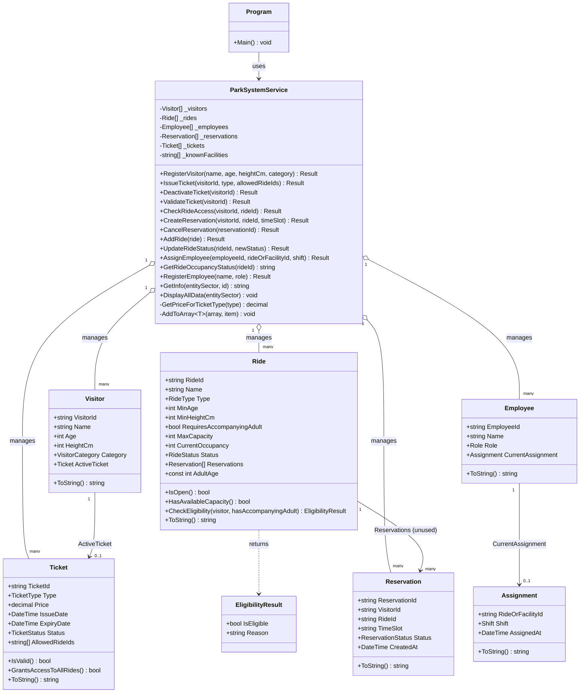
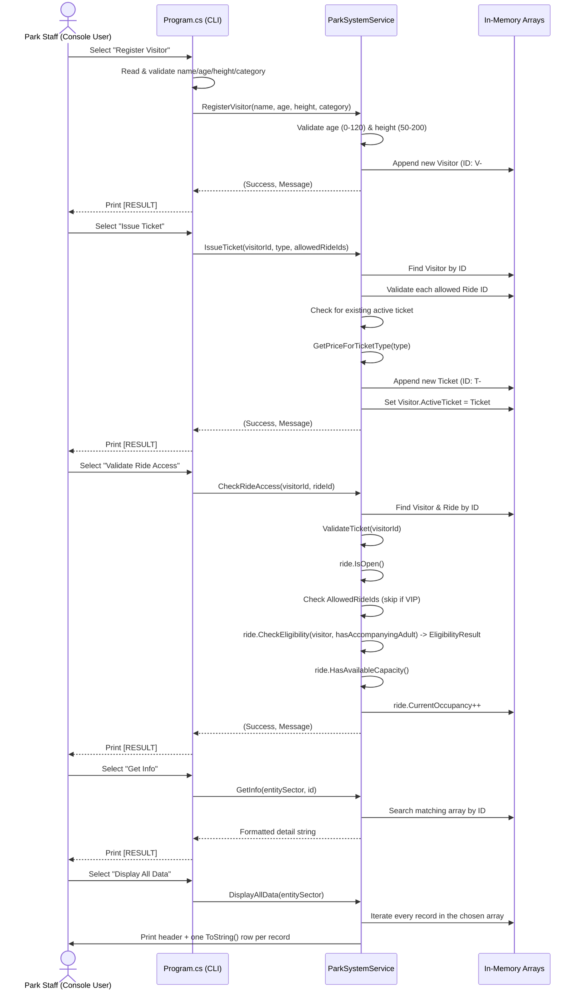

# HorizonParkSystem — Technical Documentation

**Project type:** C# / .NET 10 Console Application 
**Author:** Mohammad Shaqboua

A console-based management system for an amusement park ("Horizon Adventure Park"). It handles visitor registration, ticket issuing/validation, ride access control, ride reservations, employee management, shift assignment, and tabular data export — all through a menu-driven CLI backed by an in-memory data layer.

---

## Table of Contents

1. [README — How to Run](#readme--how-to-run)
2. [Feature Summary](#feature-summary)
3. [Project Structure](#project-structure)
4. [Enums](#enums)
5. [Models](#models)
6. [Services — `ParkSystemService`](#services--parksystemservice)
7. [Program — CLI Flow](#program--cli-flow)
8. [Class Diagram](#class-diagram)
9. [Data Flow Diagram](#data-flow-diagram)
10. [Known Limitations](#known-limitations)

---

## README — How to Run

### Prerequisites
- [.NET 10 SDK](https://dotnet.microsoft.com/download) installed (the project targets `net10.0`).
- Windows, macOS, or Linux with the `dotnet` CLI available, or JetBrains Rider / Visual Studio 2022+ (a `.sln` and Rider workspace file are included).

### Run from the command line
```bash
# From the repository root
cd HorizonParkSystem/HorizonParkSystem

# Restore & run
dotnet run
```

### Run from an IDE
1. Open `HorizonParkSystem.sln` in Rider or Visual Studio.
2. Set `HorizonParkSystem` as the startup project.
3. Run/Debug (F5).

### Using the application
The app boots into a looping text menu in the console:

```
=================================================
       HORIZON ADVENTURE PARK
          OPERATIONS SYSTEM
=================================================

  [1]  Register Visitor
  [2]  Issue Ticket
  [3]  Deactivate Ticket
  [4]  Validate Ticket
  [5]  Validate Ride Access
  [6]  Create Reservation
  [7]  Cancel Reservation
  [8]  Add Ride
  [9]  Update Ride Status
  [10] Assign Employee
  [11] View Ride Occupancy Status
  [12] Register Employee
  [13] Get Info
  [14] Display All Data
  [15] Exit
```

Pick an option by typing its number and following the prompts. Every operation prints a `[RESULT]` message reporting success or the reason for failure (options 14 prints a full table instead of a single-line message).

> **Note:** All data lives in memory for the lifetime of the process — nothing is persisted to disk or a database. Closing the app discards all visitors, tickets, rides, employees, and reservations.

### Typical workflow
1. **Add Ride** (option 8) to create at least one ride — you'll need its generated `RideId` (e.g. `RIDE-1`) later.
2. **Register Visitor** (option 1) to create a visitor and get a `VisitorId` (e.g. `V-1`).
3. **Issue Ticket** (option 2) to that visitor, optionally restricting it to specific ride IDs (VIP tickets always grant full access).
4. **Validate Ride Access** (option 5) to check the visitor into a ride — this increments the ride's occupancy.
5. Optionally **Create Reservation** (option 6) to reserve a ride/time slot ahead of time.
6. **Register Employee** (option 12) and **Assign Employee** (option 10) to staff rides or facilities.
7. Use **Get Info** (option 13) to inspect a single entity by ID, or **View Ride Occupancy Status** (option 11) for a single ride's live occupancy.
8. Use **Display All Data** (option 14) to print every record in a chosen entity sector (Visitors, Rides, Employees, Tickets, or Reservations) as a formatted table at once.

---

## Feature Summary

| Area | Implemented Features |
|---|---|
| **Visitor Management** | Register visitors with age/height validation (0–120 years, 50–200 cm); auto-generated visitor IDs (`V-#`). |
| **Ticketing** | Issue tickets of 4 types (Regular, VIP, Child, Senior) with per-type pricing; restrict Regular/Child/Senior tickets to specific ride IDs; VIP tickets auto-grant access to all rides; prevent duplicate active tickets per visitor; deactivate (cancel) tickets; validate ticket status/expiry (1-day validity). |
| **Ride Access Control** | Full eligibility pipeline combining ticket validity, ride open/closed/maintenance status, ride-specific ticket permissions, age/height eligibility, an accompanying-adult check for rides that require one, and live capacity checks; increments ride occupancy on successful entry. |
| **Reservations** | Create time-slot reservations per visitor/ride with duplicate-booking prevention and per-slot capacity enforcement; cancel reservations. |
| **Ride Management** | Add new rides with configurable type, age/height minimums, adult-accompaniment requirement, and capacity; update ride operational status (Open / Closed / Under Maintenance); query live occupancy. |
| **Employee Management** | Register employees with a role; assign employees to a ride or a known facility for a given shift, with a duplicate-assignment guard. |
| **Lookup / Reporting** | Unified "Get Info" lookup across Visitors, Rides, Employees, Tickets, and Reservations, returning a formatted detail block for any entity by ID; a "Display All Data" table view that prints every record in a chosen entity sector at once, using each model's `ToString()`. |
| **CLI** | Menu-driven console interface with input validation, clear `[ERROR]` / `[RESULT]` / `[INFO]` messaging, and a continuous loop until Exit. |

---

## Project Structure

```
HorizonParkSystem/
└── HorizonParkSystem/
    ├── Program.cs                  # CLI entry point & menu loop
    ├── Enums/                      # All enumeration types
    │   ├── EntitySector.cs
    │   ├── ReservationStatus.cs
    │   ├── RideStatus.cs
    │   ├── RideType.cs
    │   ├── Role.cs
    │   ├── Shift.cs
    │   ├── TicketStatus.cs
    │   ├── TicketType.cs
    │   └── VisitorCategory.cs
    ├── Models/                     # Domain / data classes
    │   ├── Assignment.cs
    │   ├── EligibilityResult.cs
    │   ├── Employee.cs
    │   ├── Reservation.cs
    │   ├── Ride.cs
    │   ├── Ticket.cs
    │   └── Visitor.cs
    └── Services/
        └── ParkSystemService.cs    # All business logic & in-memory storage
```

---

## Enums

Short reference for every enumeration in the `HorizonParkSystem.Enums` namespace.

| Enum | Values | Purpose |
|---|---|---|
| `EntitySector` | `Visitor`, `Ride`, `Employee`, `Ticket`, `Reservation` | Selects which entity type the "Get Info" and "Display All Data" lookups should search. |
| `ReservationStatus` | `Active`, `Cancelled` | Tracks whether a ride reservation is still valid or has been cancelled. |
| `RideStatus` | `Open`, `Closed`, `UnderMaintenance` | Current operational state of a ride; controls whether it can be entered or reserved. |
| `RideType` | `Thrill`, `Family`, `Water` | Category of a ride. |
| `Role` | `TicketBoothStaff`, `RideOperator`, `OperationsManager`, `Maintenance` | Job role of a park employee. |
| `Shift` | `Morning`, `Afternoon`, `Evening`, `Night` | Work shift used in employee assignments. |
| `TicketStatus` | `Active`, `Expired`, `Cancelled` | Lifecycle state of an issued ticket. |
| `TicketType` | `Regular`, `VIP`, `Child`, `Senior` | Determines price and ride-access rules for a ticket. |
| `VisitorCategory` | `General`, `VIP`, `Child`, `Senior`, `StaffAccompaniedMinor` | Classification of a visitor recorded at registration (informational; not used for pricing/access logic). |

---

## Models

All model classes live in the `HorizonParkSystem.Models` namespace. They are mostly plain data-holder classes; validation and behavior mostly live in the service layer, with two exceptions (`Ride` and `Ticket`) that carry a few self-contained helper methods. Every model now also overrides `ToString()` to produce a single formatted table row, used by `ParkSystemService.DisplayAllData` — the only exception is `EligibilityResult`, which is a transient result object rather than a stored entity.

### `Visitor`

| Property | Type | Description |
|---|---|---|
| `VisitorId` | `string` | Unique ID, auto-generated as `V-{n}`. |
| `Name` | `string` | Visitor's full name. |
| `Age` | `int` | Visitor's age in years. |
| `HeightCm` | `int` | Visitor's height in centimeters, used for ride eligibility. |
| `Category` | `VisitorCategory` | Visitor classification chosen at registration. |
| `ActiveTicket` | `Ticket` | The visitor's currently active ticket, if any. |

Has a constructor requiring `visitorId, name, age, heightCm, category`.

**Methods:**
- `ToString()` — returns a formatted row (ID, name, age, height, category, active ticket) for tabular display.

### `Ticket`

| Property | Type | Description |
|---|---|---|
| `TicketId` | `string` | Unique ID, auto-generated as `T-{n}`. |
| `Type` | `TicketType` | Regular / VIP / Child / Senior. |
| `Price` | `decimal` | Price charged, derived from `Type`. |
| `IssueDate` | `DateTime` | Timestamp the ticket was issued. |
| `ExpiryDate` | `DateTime` | Set to `IssueDate + 1 day`. |
| `Status` | `TicketStatus` | Active / Expired / Cancelled. |
| `AllowedRideIds` | `string[]` | Ride IDs this ticket may access (ignored for VIP). |

**Methods:**
- `IsValid()` — returns `true` only if `Status == Active` **and** `DateTime.Now <= ExpiryDate`.
- `GrantsAccessToAllRides()` — returns `true` only for `TicketType.VIP`.
- `ToString()` — returns a formatted row (ID, type, price, issue date, expiry date, status, allowed rides) for tabular display.

### `Ride`

| Property | Type | Description |
|---|---|---|
| `RideId` | `string` | Unique ID, auto-generated as `RIDE-{n}`. |
| `Name` | `string` | Ride's display name. |
| `Type` | `RideType` | Thrill / Family / Water. |
| `MinAge` | `int` | Minimum rider age. |
| `MinHeightCm` | `int` | Minimum rider height. |
| `RequiresAccompanyingAdult` | `bool` | Flag recorded at creation; now enforced by `CheckEligibility` (see below). |
| `MaxCapacity` | `int` | Maximum concurrent riders / reservations per slot. |
| `CurrentOccupancy` | `int` | Live count of visitors currently on the ride. |
| `Status` | `RideStatus` | Open / Closed / UnderMaintenance. |
| `Reservations` | `Reservation[]` | Declared on the model but not populated by the service (reservations are tracked centrally instead — see Known Limitations). |

**Constants:**
- `AdultAge` (`const int` = `18`) — the age threshold used by the accompanying-adult check below.

**Methods:**
- `IsOpen()` — `true` if `Status == RideStatus.Open`.
- `HasAvailableCapacity()` — `true` if `CurrentOccupancy < MaxCapacity`.
- `CheckEligibility(Visitor visitor, bool hasAccompanyingAdult = false)` — returns an `EligibilityResult` checking, in order: the visitor's age against `MinAge`, the visitor's height against `MinHeightCm`, and — if `RequiresAccompanyingAdult` is `true` **and** the visitor's age is below `AdultAge` (18) **and** `hasAccompanyingAdult` is `false` — fails with a message stating the ride requires a minor to be accompanied by an adult and none was confirmed. Returns eligible only if all checks pass.
- `ToString()` — returns a formatted row (ID, name, type, status, min age, min height, occupancy/capacity, and the accompanying-adult requirement) for tabular display.

### `Employee`

| Property | Type | Description |
|---|---|---|
| `EmployeeId` | `string` | Unique ID, auto-generated as `E-{n}`. |
| `Name` | `string` | Employee's full name. |
| `Role` | `Role` | Job role. |
| `CurrentAssignment` | `Assignment` | The employee's current ride/facility + shift assignment, if any. |

**Methods:**
- `ToString()` — returns a formatted row (employee ID, name, role, ride/facility, shift, assigned-at timestamp) for tabular display.

### `Assignment`

| Property | Type | Description |
|---|---|---|
| `RideOrFacilityId` | `string` | ID of the ride, or the name of a known facility, the employee is assigned to. |
| `Shift` | `Shift` | Which shift the assignment covers. |
| `AssignedAt` | `DateTime` | Timestamp the assignment was made. |

### `Reservation`

| Property | Type | Description |
|---|---|---|
| `ReservationId` | `string` | Unique ID, auto-generated as `R-{n}`. |
| `VisitorId` | `string` | ID of the visitor who booked the slot. |
| `RideId` | `string` | ID of the reserved ride. |
| `TimeSlot` | `string` | Time slot string (validated as a `TimeSpan`, e.g. `"14:30"`). |
| `Status` | `ReservationStatus` | Active / Cancelled. |
| `CreatedAt` | `DateTime` | Timestamp the reservation was created. |

**Methods:**
- `ToString()` — returns a formatted row (reservation ID, visitor ID, ride ID, time slot, status, created-at timestamp) for tabular display.

### `EligibilityResult`

| Property | Type | Description |
|---|---|---|
| `IsEligible` | `bool` | Whether the visitor meets the ride's requirements. |
| `Reason` | `string` | Human-readable explanation (used when `IsEligible == false`, and set to `"Eligible"` otherwise). |

---

## Services — `ParkSystemService`

`ParkSystemService` (namespace `HorizonParkSystem.Services`) is the single service class in the project. It owns all in-memory storage and every business rule. Internally it stores each entity type in a plain array (`Visitor[]`, `Ride[]`, `Employee[]`, `Reservation[]`, `Ticket[]`), growing them with a private generic helper, `AddToArray<T>`, which resizes the array and appends the new item. ID counters (`_ticketCounter`, `_reservationCounter`, `_visitorCounter`, `_rideCounter`, `_employeeCounter`) are incremented on each creation to produce sequential IDs. A fixed list of `_knownFacilities` (`Main Gate`, `Ticket Booth A`, `Ticket Booth B`, `First Aid`, `Food Court`) supports non-ride employee assignments.

Most public methods return a `(bool Success, string Message)` tuple: `Success` indicates whether the operation completed, and `Message` is a human-readable outcome that the CLI prints directly.

### `RegisterVisitor(name, age, heightCm, category)`
Validates that `age` is between 0–120 and `heightCm` is between 50–200. If valid, generates a new `V-{n}` ID, constructs a `Visitor`, and appends it to `_visitors`. Returns a failure message if either range check fails, otherwise a success message including the new ID.

### `IssueTicket(visitorId, type, allowedRideIds)`
1. Looks up the visitor by ID (fails if not found).
2. Verifies every ID in `allowedRideIds` corresponds to an existing ride, collecting any invalid ones and failing with a list of them if any are invalid.
3. Fails if the visitor already holds an active ticket.
4. Computes the price via `GetPriceForTicketType`, builds a `Ticket` with a 1-day expiry from now, stores it in `_tickets`, and sets it as the visitor's `ActiveTicket`.

### `DeactivateTicket(visitorId)`
Looks up the visitor, fails if not found or if they have no ticket or an already-cancelled ticket, otherwise sets the ticket's `Status` to `Cancelled`.

### `ValidateTicket(visitorId)`
Looks up the visitor and checks, in order: visitor exists → ticket exists → ticket not cancelled → `ticket.IsValid()` (active status and not expired). Returns the first failure encountered, or a success message if all checks pass. This method is also called internally by `CheckRideAccess`.

### `CheckRideAccess(visitorId, rideId)`
The core access-control pipeline for entering a ride:
1. Visitor and ride must both exist.
2. Delegates ticket validity to `ValidateTicket` and short-circuits on failure.
3. Ride must be `Open` (`ride.IsOpen()`).
4. If the ticket is not VIP (`GrantsAccessToAllRides()` is false), the ride ID must be present in the ticket's `AllowedRideIds`.
5. Runs `ride.CheckEligibility(visitor, hasAccompanyingAdult)` for age/height requirements, and — for rides flagged `RequiresAccompanyingAdult` — the accompanying-adult check described under the `Ride` model.
6. Ride must have available capacity (`HasAvailableCapacity()`).
7. On full success, increments `ride.CurrentOccupancy` and returns a success message.

> ⚠️ **Worth double-checking:** the CLI's "Validate Ride Access" flow (option 5) only prompts for a Visitor ID and a Ride ID — it doesn't currently ask staff to confirm whether an accompanying adult is present. If `CheckRideAccess` doesn't collect and forward that confirmation from elsewhere, `hasAccompanyingAdult` will effectively always be `false` for CLI-driven checks, meaning any ride with `RequiresAccompanyingAdult = true` will always block unaccompanied minors — which may be the intended behavior, but is worth confirming against the actual service code.

### `CreateReservation(visitorId, rideId, timeSlot)`
1. Visitor and ride must exist, and the ride must be `Open`.
2. `timeSlot` must parse as a `TimeSpan` (e.g. `HH:mm`).
3. Prevents the same visitor from double-booking the same ride/time slot.
4. Counts existing active reservations for that ride/time slot and rejects the booking if the count has reached `MaxCapacity`.
5. Creates and stores a new `Reservation` with `Active` status.

### `CancelReservation(reservationId)`
Looks up the reservation by ID, fails if not found or already cancelled, otherwise sets its status to `Cancelled`.

### `AddRide(ride)`
Validates that `MinAge >= 0`, `MinHeightCm >= 0`, and `MaxCapacity > 0`. Assigns a new `RIDE-{n}` ID and appends the ride to `_rides`.

### `UpdateRideStatus(rideId, newStatus)`
Looks up the ride by ID (fails if not found) and overwrites its `Status`.

### `AssignEmployee(employeeId, rideOrFacilityId, shift)`
1. Employee must exist.
2. `rideOrFacilityId` must match either an existing ride ID or one of the `_knownFacilities` names, otherwise fails.
3. Fails if the employee is already assigned to the exact same shift (regardless of location) — this specific guard only checks the shift, not the location, so re-assigning to a different location during the same shift the employee is already working is also blocked.
4. Creates a new `Assignment` (with the current timestamp) and sets it as the employee's `CurrentAssignment`, overwriting any previous one.

### `GetRideOccupancyStatus(rideId)`
Looks up the ride by ID and returns a one-line string with name, current/max occupancy, and status, or a not-found message.

### `RegisterEmployee(name, role)`
Generates a new `E-{n}` ID, constructs an `Employee`, and appends it to `_employees`.

### `GetInfo(entitySector, id)`
A single dispatcher that, based on the requested `EntitySector`, searches the corresponding array by ID and returns a formatted multi-line detail block (or a not-found message):
- **Visitor** → ID, name, age, height, category, and active ticket summary.
- **Ride** → ID, name, type, min age/height, occupancy, and status.
- **Employee** → ID, name, role, and current assignment summary.
- **Ticket** → ID, type, price, status, and expiry.
- **Reservation** → ID, visitor, ride, time slot, and status.

### `DisplayAllData(entitySector)`
A `void` dispatcher (no return value) that prints a full table of **every** record in the requested `EntitySector` directly to the console, rather than looking up a single ID:
1. Prints a column-header line whose labels match the chosen sector (e.g. ID / Name / Age / Height / Category / Active Ticket for `Visitor`).
2. Prints a `-` separator line sized to the header.
3. Iterates the corresponding in-memory array (`_visitors`, `_rides`, `_employees`, `_tickets`, or `_reservations`) and writes each item's `ToString()` as one row.

Unlike `GetInfo`, this method doesn't return a string for the CLI to print — it writes straight to `Console.Out` itself, so `Program.cs` just calls it and moves on.

### `GetPriceForTicketType(type)` *(private)*
A simple switch mapping `TicketType` to price: VIP = 100, Regular = 50, Child = 30, Senior = 35 (defaulting to 50).

### `AddToArray<T>(ref T[] array, T item)` *(private, static, generic)*
Resizes the array by one slot and appends `item` at the end. Used by every "create" operation instead of a `List<T>`.

---

## Program — CLI Flow

`Program.cs` is a top-level-statements entry point. It instantiates one `ParkSystemService` and runs an infinite `while (true)` loop that:

1. Clears the console and prints the main menu (15 numbered options).
2. Reads a line of input and parses it as an integer; on parse failure, shows an error and restarts the loop.
3. Uses a `switch` on the chosen number, where each `case` block:
   - Clears the console and prints a section header.
   - Prompts for the required inputs one at a time via `Console.ReadLine()`, validating each (empty-string checks for text, `int.TryParse`/`bool.TryParse` for numbers) and aborting the operation back to the menu on the first invalid input.
   - For inputs that map to an enum (visitor category, ticket type, ride type/status, shift, role, entity sector), shows a small numbered sub-menu and converts the numeric choice to the enum value via a `switch` expression, defaulting to the first enum value on an unrecognized number.
   - Calls the matching `ParkSystemService` method.
   - Prints the returned `Message` (or the returned string, for options 11 and 13) under a `[RESULT]` header.
   - Waits for `Enter` before looping back to the menu.
4. `case 14` prompts for an `EntitySector` via the same numbered sub-menu pattern, clears the console, and calls `parkService.DisplayAllData(sector)`, which prints a full table of every record in that sector directly to the console (this case doesn't go through the `[RESULT]` block, since `DisplayAllData` returns `void`).
5. `case 15` prints a goodbye message and returns, ending the program.
6. `default` handles any unrecognized menu number with an error message.

Because the loop only exits on option 15, the application behaves as a persistent session: all objects created (visitors, rides, tickets, etc.) remain available in memory for later menu selections until the process exits.

---

## Class Diagram



---

## Data Flow Diagram

The diagram below traces a typical end-to-end visitor journey — from registration to riding an attraction — showing how data moves between the CLI, the service layer, and in-memory storage.



**Summary of the flow:**
1. The **Program (CLI)** layer only handles console I/O — reading raw input, converting menu numbers into enum values, and printing results. It holds no business data itself.
2. Every action is delegated to the single **`ParkSystemService`** instance created at startup, which acts as the sole gatekeeper for all business rules (validation, eligibility, capacity, duplicate checks).
3. `ParkSystemService` reads from and writes to its private **in-memory arrays** (`_visitors`, `_rides`, `_tickets`, `_reservations`, `_employees`), which are the only persistent state for the lifetime of the process.
4. Related entities are cross-referenced by ID string (e.g. a `Ticket.AllowedRideIds` referencing `Ride.RideId`, or a `Reservation.VisitorId` referencing `Visitor.VisitorId`) rather than by object reference — lookups are done via linear search each time.
5. Results always flow back up as a `(bool Success, string Message)` tuple, a formatted string for `GetInfo`, or (for `DisplayAllData` alone) written straight to the console with no return value, which the CLI prints/relays verbatim without further interpretation.

---

## Known Limitations

- **No persistence:** all data is lost when the application exits (no file/database storage).
- **Linear search everywhere:** entities are stored in plain arrays and located with `foreach` loops rather than dictionaries/indexes, which is fine at small scale but not efficient for large datasets.
- **`Ride.Reservations` is unused:** the property exists on the model but `CreateReservation` stores reservations only in the service's central `_reservations` array, never populating this array on the `Ride` object.
- **Accompanying-adult confirmation isn't collected by the CLI:** `Ride.CheckEligibility` now enforces `RequiresAccompanyingAdult` via a `hasAccompanyingAdult` parameter, but the "Validate Ride Access" menu option only prompts for a Visitor ID and Ride ID — it never asks staff to confirm an adult is present. Unless `CheckRideAccess` sources this value from somewhere else, it will effectively always evaluate as `false`, meaning any ride with `RequiresAccompanyingAdult = true` will block every unaccompanied minor with no way for staff to override it through the CLI.
- **`AssignEmployee` shift-conflict check is shift-only:** it blocks re-assignment whenever the employee's current shift matches the requested shift, even if the new location differs, rather than checking for a true double-booking.
- **No automatic ticket expiration sweep:** a ticket only becomes practically invalid when `IsValid()` is evaluated (during `ValidateTicket`); the `TicketStatus.Expired` enum value itself is never actually assigned anywhere in the code.
